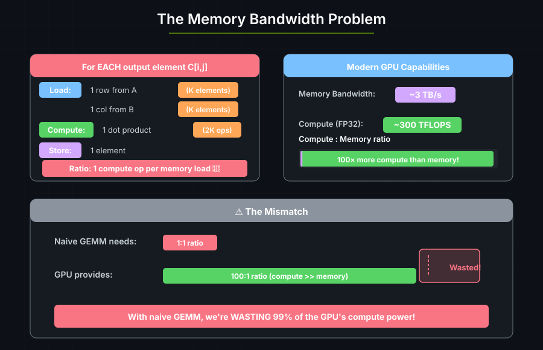
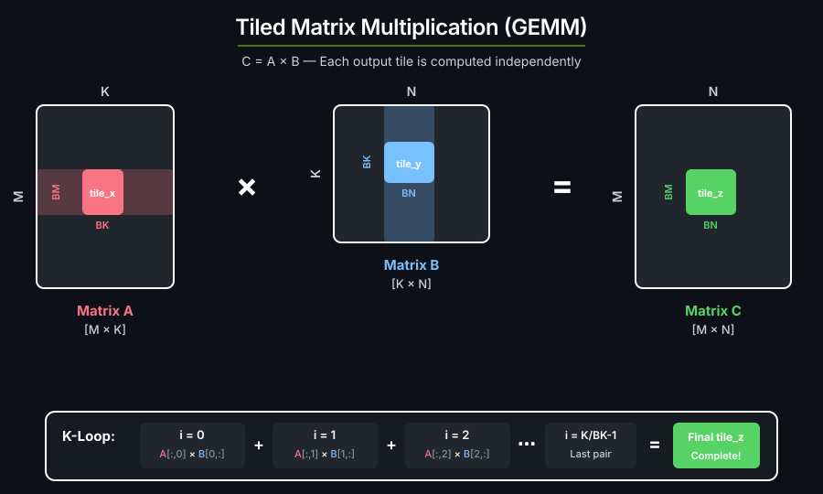
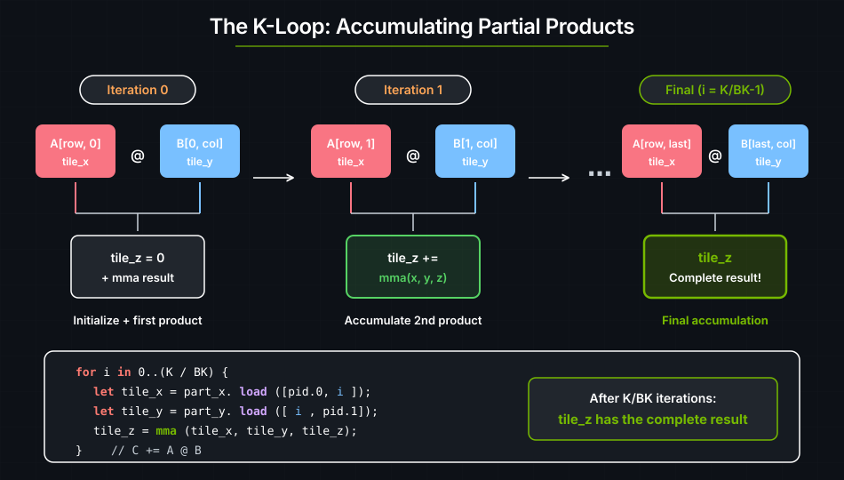
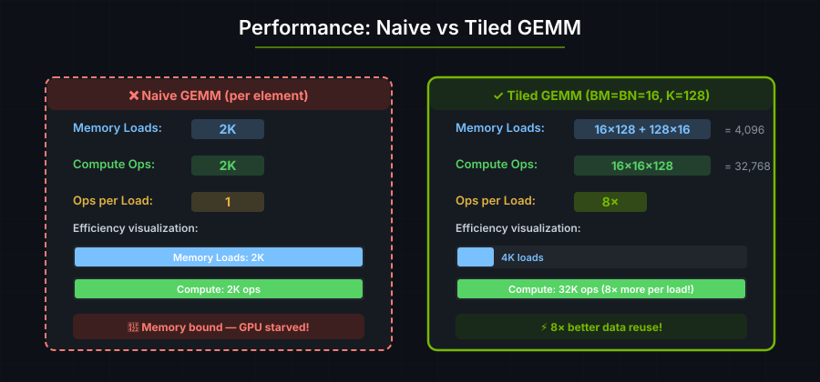

# 4. Matrix Multiplication

<!-- TODO: This tutorial has grown to cover basic GEMM, const generic inference,
mapped persistent GEMM, unsafe optimization hints, and fully static GEMM. Split
or streamline it when there is bandwidth: keep this page focused on the first
GEMM path and move advanced performance variants to separate pages. -->

Matrix multiplication (GEMM, or General Matrix Multiply) is used in:

| Application | Where GEMM is Used |
|-------------|-------------------|
| **Transformers** | Attention and Fully Connected layers — 90%+ of compute |
| **CNNs** | Convolutions expressed as matrix multiplications |
| **Scientific Computing** | Simulations and solvers |
| **Graphics** | Transformations, lighting calculations |

---

## Naive GEMM is Memory-Bound

The naive algorithm for C = A × B is:

```text
for each output element C[i,j]:
    sum = 0
    for k in 0..K:
        sum += A[i,k] * B[k,j]
    C[i,j] = sum
```



Each element of A and B is loaded from global memory repeatedly. To get good performance, we need to load data once and reuse it many times.

---

## Tiled Matrix Multiplication

Instead of computing one element at a time, we compute **tiles** of elements:



```text
Per output TILE (BM × BN elements):
  - Load BM × K elements from A (once per row group)
  - Load K × BN elements from B (once per column group)
  - Do BM × BN × K multiply-adds

Memory loads: BM×K + K×BN    Compute: BM×BN×K ops
Ratio: With BM=BN=BK=16: ~16× better data reuse!
```

Each loaded element of A is reused BN times, and each element of B is reused
BM times. This reduces global-memory traffic.

---

<a id="the-code"></a>
## GEMM kernel

```rust
use cuda_async::device_operation::DeviceOp;
use cuda_core::Device;
use std::sync::Arc;
use cutile;
use cutile::api;
use cutile::DType;
use cutile::error::Error;
use cutile::tensor::{IntoPartition, Tensor, ToHostVec, Unpartition};
use cutile::tile_kernel::TileKernel;

#[cutile::module]
mod my_module {
    use cutile::core::*;

    #[cutile::entry()]
    fn gemm<E: ElementType, const BM: i32, const BN: i32, const BK: i32, const K: i32>(
        z: &mut Tensor<E, { [BM, BN] }>,   // Output tile
        x: &Tensor<E, { [-1, K] }>,        // A matrix
        y: &Tensor<E, { [K, -1] }>,        // B matrix
    ) {
        let part_x = x.partition(shape![BM, BK]);
        let part_y = y.partition(shape![BK, BN]);
        let pid_m = program_id(0);
        let pid_n = program_id(1);

        let mut tile_z = load_tile_mut(z);

        for i in 0i32..(K / BK) {
            let tile_x = part_x.load([pid_m, i]);
            let tile_y = part_y.load([i, pid_n]);
            tile_z = mma(tile_x, tile_y, tile_z);  // C += A @ B
        }
        z.store(tile_z);
    }
}

use my_module::gemm;

fn main() -> Result<(), Error> {
    let device = Device::new(0)?;
    let stream = device.new_stream()?;

    let (bm, bn, bk) = (16usize, 16usize, 8usize);
    let (m, n, k) = (64usize, 64usize, 64usize);

    let generics = vec![
        f32::DTYPE.as_str().to_string(),
        bm.to_string(), bn.to_string(), bk.to_string(), k.to_string()
    ];

    let z = api::zeros(&[m, n]).partition([bm, bn]).sync_on(&stream)?;
    let x: Arc<Tensor<f32>> = api::ones(&[m, k]).map(Into::into).sync_on(&stream)?;
    let y: Arc<Tensor<f32>> = api::ones(&[k, n]).map(Into::into).sync_on(&stream)?;

    let (z, _x, _y) = gemm(z, x, y).generics(generics).sync_on(&stream)?;

    let z_host: Vec<f32> = z.unpartition().to_host_vec().sync_on(&stream)?;
    println!("z[0] = {} (expected {})", z_host[0], k);


    Ok(())
}
```

**Output:**

```text
z[0] = 64 (expected 64)
```

Each output element is the dot product of a row of ones with a column of ones, which equals K. With K=64, every output element is 64.

---

## The K-Loop

The K-loop iterates over pairs of tiles from A and B, accumulating partial products into the output tile:

```rust
for i in 0i32..(K / BK) {
    let tile_x = part_x.load([pid_m, i]);  // Load A[row_group, i]
    let tile_y = part_y.load([i, pid_n]);  // Load B[i, col_group]
    tile_z = mma(tile_x, tile_y, tile_z);  // Accumulate: C += A @ B
}
```



---

## The `mma()` Intrinsic

`mma` stands for **Matrix Multiply-Accumulate**:

```rust
tile_z = mma(tile_x, tile_y, tile_z);
// Equivalent to: tile_z = tile_x @ tile_y + tile_z
```

On modern GPUs (Volta and later), this maps directly to **Tensor Cores** — specialized hardware that can multiply small matrices (like 16×16×16) in a single operation.

---

## Const Generics and JIT Recompilation

```rust
fn gemm<E: ElementType, const BM: i32, const BN: i32, const BK: i32, const K: i32>
```

These are **const generics** — values known at compile time:

1. **Loop unrolling:** `for i in 0..(K/BK)` can be fully unrolled.
2. **Register allocation:** The compiler knows exactly how many registers are needed.
3. **Tensor Core mapping:** The hardware requires specific tile sizes.

They are passed via `.generics()`:

```rust
let generics = vec!["f32".to_string(), "16".to_string(), "16".to_string(), "8".to_string(), "64".to_string()];
gemm(z, x, y).generics(generics)
```

Changing a type parameter or const generic in the entry function signature creates a new compiled variant. The first time a variant is launched, cuTile compiles the kernel through Tile IR bytecode → cubin. The resulting binary is cached, so subsequent launches that resolve to the same variant reuse it. Launching with different generics — for example, switching from `K=64` to `K=128` — produces a new compilation. The full cache rules, including compile options and specialization hints, are covered in [Compilation](../guide/jit-compilation.md).

This is the tradeoff between **static** and **dynamic** shape dimensions. In the GEMM signature above, `K` is a const generic while the M and N dimensions of `x` and `y` are dynamic (`-1`):

```rust
x: &Tensor<E, { [-1, K] }>,   // M is dynamic (-1), K is static
y: &Tensor<E, { [K, -1] }>,   // K is static, N is dynamic (-1)
```

- **Static dimensions** (const generics) enable aggressive optimization but trigger recompilation when they change.
- **Dynamic dimensions** (`-1`) carry no optimization benefit but can vary freely across launches without creating a new compiled variant.

As a rule, make tile sizes (`BM`, `BN`, `BK`) static — they are fixed for a given kernel variant and the compiler needs them for register allocation and Tensor Core mapping. Make problem dimensions that change often (such as sequence length or batch size) dynamic.



With larger tiles (like 128×128), you can achieve even better ratios, approaching the GPU's theoretical peak.

---

## Const Generic Inference

SAXPY needs no `.generics()` call: cuTile infers the const generics from the
host-side output partition.

Consider SAXPY's kernel signature:

```rust
fn saxpy<const S: [i32; 2]>(
    y: &mut Tensor<f32, S>,
    a: f32,
    x: &Tensor<f32, { [-1, -1] }>
)
```

On the host side, `y` is a `Partition<Tensor<f32>>` created by calling `.partition([2, 2])`. The `partition_shape` of that `Partition` — `[2, 2]` — is used to infer `S`. Since `S` is the only const generic and it appears directly in the `&mut Tensor<f32, S>` parameter, cutile can infer everything it needs from the host-side types alone. No `.generics()` call required.

The inference rule is the same as Rust: const generics that appear in the shape of a `&mut Tensor` are read from the `Partition`'s `partition_shape`, and const generics that appear in the shape of a `&Tensor` are read from the tensor's `shape`. Type parameters like `E: ElementType` are inferred from the tensor's `dtype()`.

For GEMM, this inference is **partial**:

```rust
fn gemm<E: ElementType, const BM: i32, const BN: i32, const BK: i32, const K: i32>(
    z: &mut Tensor<E, { [BM, BN] }>,   // BM, BN inferred from z's partition_shape
    x: &Tensor<E, { [-1, K] }>,        // K inferred from x's shape[1]
    y: &Tensor<E, { [K, -1] }>,        // K also available from y's shape[0]
)
```

| Generic | Appears in | Inferred from | Inferable? |
|---------|-----------|---------------|------------|
| `E` | `z`, `x`, `y` | `z.dtype()` | Yes |
| `BM` | `z` (`&mut`) | `z.partition_shape[0]` | Yes |
| `BN` | `z` (`&mut`) | `z.partition_shape[1]` | Yes |
| `K` | `x`, `y` | `x.shape()[1]` | Yes |
| `BK` | — | — | No |

`BM` and `BN` are known at kernel launch time because they are embedded in the `Partition` created by `.partition([bm, bn])`. `K` is known because it appears as a dimension of the input tensors `x` and `y`. But `BK` does not appear in the type of any kernel argument — it is only used *inside* the kernel body when partitioning `x` and `y` into tiles:

```rust
let part_x = x.partition(shape![BM, BK]);
let part_y = y.partition(shape![BK, BN]);
```

The launcher cannot infer `BK` from a tensor or partition, so GEMM needs an
explicit `.generics()` call.

As a general rule: if every const generic appears somewhere in the kernel's `&Tensor` or `&mut Tensor` parameter types, inference will work and `.generics()` is optional. If any const generic is used only inside the kernel body (like `BK`), you must pass all generics explicitly.

---

(optimization-achieving-speed-of-light-performance)=
## GEMM optimization

The GEMM kernel above is correct but does not reach the GPU's theoretical peak
(speed-of-light, or SoL) throughput. The recommended safe path is mapped
persistent GEMM: the output partition produces bounded, disjoint indices, and
the compiler derives the input bounds from the loops that produce each index.
This avoids `unsafe` and does not require making full tensor dimensions const
generics.

### Approach 1: Mapped Persistent GEMM (Safe, Recommended)

Mapped output partitions expose an iterator over output tile indices. The
indices are produced by the partition itself, so stores are bounded and
disjoint. The K-loop iterates `0..num_tiles(&part_x, 1)` and indexes the input
partitions with plain arrays; the compiler infers the same bounds from the loop
and the mapped components, and verifies the cross-tensor ties (for example
`ceil(dim(x, 1)/BK) <= ceil(dim(y, 0)/BK)`) as launch checks before any GPU
work. `deny_in_kernel_checks = true` turns any check that would remain in the
kernel into a compile error, so the body is assert-free by construction:

```rust
#[cutile::entry(
    optimization_hints = (
        sm_120 = (num_cta_in_cga = 2,),
        sm_100 = (num_cta_in_cga = 2,),
    ),
    deny_in_kernel_checks = true,
)]
fn gemm_persistent<
    T: ElementType,
    const BM: i32,
    const BN: i32,
    const BK: i32,
    const MAP_SHAPE: [i32; 2],
>(
    mut z: MappedPartitionMut<T, { [BM, BN] }, MAP_SHAPE>,
    x: &Tensor<T, { [-1, -1] }>,
    y: &Tensor<T, { [-1, -1] }>,
) {
    let part_x = x.partition(shape![BM, BK]);
    let part_y = y.partition(shape![BK, BN]);

    for out_idx in z.iter_indices() {
        let (bid_m, bid_n) = out_idx.components();

        let mut tile_z: Tile<T, { [BM, BN] }> = constant(T::ZERO, shape![BM, BN]);
        for k_tile in 0i32..num_tiles(&part_x, 1) {
            let tile_x = part_x.load([bid_m, k_tile]);
            let tile_y = part_y.load([k_tile, bid_n]);
            tile_z = mma(tile_x, tile_y, tile_z);
        }
        z.store(tile_z, out_idx);
    }
}
```

`with_bounds(...)`, `Dim::new(...)`, and `coord(...)` from earlier versions of
this kernel are deprecated since 0.3.0; see
[Bounds-Check Placement](../guide/bounds-check-placement.md) for the placement
rules.

On the host side, `.map(...)` selects the mapped output traversal and the launch
grid is inferred from the mapped partition:

```rust
let z = z.partition([BM, BN]).map([4, 1], num_tile_blocks);
let (z, _x, _y) = gemm_persistent(z, x, y)
    .generics(generics)
    .sync_on(&stream)?;
```

Changing the full runtime tensor dimensions does not require recompilation.
Only the type-level parameters, such as tile sizes and the map shape, specialize
the JIT compilation.

See [`cutile-examples/examples/persistent_gemm.rs`](https://github.com/NVIDIA/cuda-rust/blob/main/cutile-rs/cutile-examples/examples/persistent_gemm.rs) for the complete example.

### Approach 2: Disabling Bounds Checks (Unsafe)

The `#[cutile::entry()]` attribute accepts `unchecked_accesses` and
`optimization_hints`. Setting `unchecked_accesses = true` disables runtime
bounds checks on all tensor loads and stores and requires an `unsafe` entry
point. `optimization_hints` supplies architecture-specific tuning parameters:

```rust
#[cutile::entry(
    unchecked_accesses = true,
    optimization_hints = (
        sm_120 = (num_cta_in_cga = 2, max_divisibility = 16,),
    )
)]
unsafe fn gemm<T: ElementType, const BM: i32, const BN: i32, const BK: i32>(
    z: &mut Tensor<T, { [BM, BN] }>,
    x: &Tensor<T, { [-1, -1] }>,
    y: &Tensor<T, { [-1, -1] }>,
    k: i32,
) {
    let part_x = x.partition(shape![BM, BK]);
    let part_y = y.partition(shape![BK, BN]);
    let pid_m = program_id(0);
    let pid_n = program_id(1);
    let mut tile_z: Tile<T, { [BM, BN] }> = z.load();
    for i in 0i32..(k / BK) {
        let tile_x = part_x.load([pid_m, i]);
        let tile_y = part_y.load([i, pid_n]);
        tile_z = mma(tile_x, tile_y, tile_z);
    }
    z.store(tile_z);
}
```

This version changes three parts of the kernel:

- **`unchecked_accesses = true`** removes bounds-checking overhead on every `load` and `store` call.
- **`sm_120 = (num_cta_in_cga = 2, max_divisibility = 16,)`** is an architecture-specific hint for Blackwell (SM 120) that groups two CTAs into a CGA for better inter-SM data sharing and caps auto-inferred alignment at 16.
- **`k` is passed as a runtime `i32`** rather than a const generic, so changing the K dimension does not create a new compiled variant.

The compiler still checks tile shapes, `mma` dimensions, and element types.
`unchecked_accesses` disables only runtime bounds checks.

The call site must also use an `unsafe` block:

```rust
unsafe {
    let (z, _, _, _) = gemm(z, x, y, k as i32)
        .generics(generics)
        .sync_on(&stream)?;
}
```

See [`cutile-benchmarks/benches/gemm.rs`](https://github.com/NVIDIA/cuda-rust/blob/main/cutile-rs/cutile-benchmarks/benches/gemm.rs) for a full benchmark comparing optimized and unoptimized variants.

### Approach 3: Fully Static GEMM (Safe, Legacy)

The older safe performance path is to make **all** tensor dimensions static const
generics. When the compiler knows every dimension and the launch grid at JIT
time, it can prove direct `program_id(axis)` partition accesses are in bounds
and optimize the checks away entirely - no `unsafe` required:

```rust
#[cutile::entry()]
fn gemm<
    E: ElementType,
    const BM: i32, const BN: i32, const BK: i32,
    const M: i32, const N: i32, const K: i32,
>(
    z: &mut Tensor<E, { [BM, BN] }>,
    x: &Tensor<E, { [M, K] }>,
    y: &Tensor<E, { [K, N] }>,
) {
    let part_x = x.partition(shape![BM, BK]);
    let part_y = y.partition(shape![BK, BN]);
    let mut tile_z = load_tile_mut(z);
    let pid_m = program_id(0);
    let pid_n = program_id(1);
    for i in 0i32..(K / BK) {
        let tile_x = part_x.load([pid_m, i]);
        let tile_y = part_y.load([i, pid_n]);
        tile_z = mma(tile_x, tile_y, tile_z);
    }
    z.store(tile_z);
}
```

In this version:

- **`x: &Tensor<E, { [M, K] }>` and `y: &Tensor<E, { [K, N] }>`** — input dimensions are fully static instead of dynamic (`-1`). The compiler sees the exact shape of every tensor.
- **No `unsafe`, no `unchecked_accesses`** — bounds checks are present in the source but the JIT compiler proves they are redundant and eliminates them during optimization.
- **`M`, `N`, `K` are const generics** — they must be passed via `.generics()` at launch time, and every new combination creates a new compiled variant.
- **`.const_grid(grid)`** — optional. The launch grid is inferred from the output partition as usual; `.const_grid()` additionally passes the grid as a compile-time constant, which gives the compiler exact bounds for `program_id(axis)` / `num_programs(axis)` and makes the grid part of the specialization key (each distinct grid is its own compiled variant). The grid is computed from the output partition (`let grid = z.grid()?`):

```rust
let grid = z.grid()?;
let (z, _x, _y) = gemm(z, x, y)
    .const_grid(grid)
    .generics(generics)
    .sync_on(&stream)?;
```

See [`cutile-examples/examples/gemm_static.rs`](https://github.com/NVIDIA/cuda-rust/blob/main/cutile-rs/cutile-examples/examples/gemm_static.rs) for the legacy static example.

### Choosing Between the Approaches

| | Mapped Persistent | Unsafe + Hints | Fully Static |
|---|---|---|---|
| **Safety** | Safe bounded/disjoint output iteration | `unsafe` - programmer must ensure correct dimensions | Safe - compiler verifies direct static accesses |
| **Compilation behavior** | Tile sizes and map shape create new compiled variants | Tile sizes create new compiled variants | Every full tensor shape creates a new compiled variant |
| **Flexibility** | Problem sizes can change at runtime | Problem sizes can change at runtime | Each new problem size is a new compilation |
| **Compile-time checks** | Tile shapes, types, and mapped index proofs | Tile shapes and types still checked | All shapes and types checked |
| **Best for** | Default high-performance safe GEMM | Escape hatch for manually proven kernels | Legacy fixed-size kernels |

Start with mapped persistent GEMM. An unsafe kernel requires a manual proof of
its access pattern and is useful when that pattern cannot yet be expressed in
the safe DSL. Fully static GEMM suits older kernels or a small, fixed set of
tensor shapes.

---

## Key Takeaways

| Concept | What It Means |
|---------|---------------|
| **Tiling** | Process data in blocks to maximize data reuse |
| **K-loop** | Iterate over tile pairs, accumulating partial results |
| **mma()** | Matrix multiply-accumulate, maps to Tensor Cores |
| **Const generics** | Tile sizes known at compile time for optimization; changing them creates a new compiled variant |
| **Const generic inference** | Generics appearing in `&mut Tensor` / `&Tensor` parameter types are inferred from host-side `Partition` shapes and tensor shapes; generics used only inside the kernel body (like `BK`) must be passed explicitly |
| **Dynamic dimensions (`-1`)** | Can vary across launches without creating a new compiled variant |
| **Arithmetic intensity** | Ratio of compute to memory ops — higher is better |
| **Mapped output iteration** | Recommended safe performance path for persistent GEMM |
| **`unchecked_accesses`** | Disables runtime bounds checks for peak performance; requires `unsafe` |
| **Fully static shapes** | Legacy safe path that lets the compiler eliminate direct block-id bounds checks |

---

### Exercise 1: Change Tile Sizes

Experiment with different `(BM, BN, BK)` values:
- Try `(32, 32, 16)` — larger tiles.
- Try `(8, 8, 4)` — smaller tiles.

Measure each configuration over multiple runs. Which is faster?

### Exercise 2: Non-Square Matrices

Modify to multiply `[M, K] @ [K, N]` where M ≠ N:

```rust
let (m, n, k) = (128, 256, 64);  // Non-square output
```

Does the code need changes?

### Exercise 3: Mixed Precision

Try using `f16` (half precision) for inputs and `f32` for the accumulator. This is common in ML for faster compute.

---

## See also

- [Tensors and Tiles](../guide/tensors-and-tiles.md#tiled-matrix-multiply) — `mma` usage and the accumulate pattern
- [Useful Mental Models](../guide/useful-mental-models.md) — 2D partitioning and grid mapping
- [Performance](../guide/performance.md) — Tensor Core usage and tile-size selection
- [DSL API](../reference/dsl-api.md#matrix-multiply) — `mma` signature and element-type constraints
- [Inference with NVFP4/MXFP8](11-nvfp4-inference.md) — packed FP4, FP8 data, and block-scaled MMA
